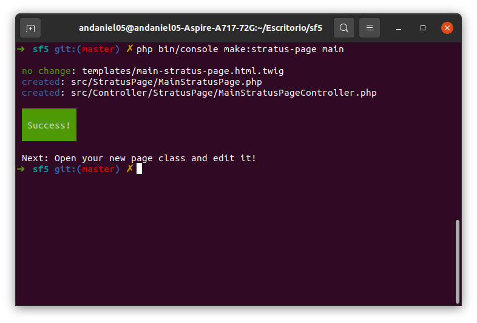

# ThenLabsStratusBundle

Extends Symfony to the full stack development with integration of [StratusPHP][stratus-php-repo].

**Notice: Like [StratusPHP][stratus-php-repo], this project is also in development and should not be used in a real project yet.**

## Installation.

Install StratusPHP specifying the development version.

    $ composer require thenlabs/stratus-php 1.0.x-dev

Install the maker bundle in case it isn't.

    $ composer require symfony/maker-bundle --dev

Install this bundle:

    $ composer require thenlabs/stratus-bundle dev-master

## Usage.

### Creating reactive pages.

Once the installation has finished we can create the application pages that will bring the integration with StratusPHP.

In order to create a new page run the next command:

    $ php bin/console make:stratus-page main

In this case, "main" refers to the page name.



As you can see, they was created three files, a template, a controller, and a class. You can review these files and edit it according to the project needs.

In the controller class you can fix the page route. By default will be like the page name, `/main` in this case.

The template file is empty by default but you should edit it with the page view.

In this example we will develop the [Example 2](https://thenlabs.org/en/doc/stratus-php/master/examples/2/example.html) of the StratusPHP docs.

```twig
{# templates/main-stratus-page.html.twig #}




    <input s-element="myInput" type="text">
    <label s-element="myLabel"></label>
    <button s-element="myButton" s-element-event-click="clickOnTheButton">Greet</button>

```

>It’s very important highligh the `s-element` attribute and his value on key elements of the page view.

```php
<?php
// src/StratusPage/MainStratusPage.php

namespace App\StratusPage;

use ThenLabs\Bundle\StratusBundle\Annotation\StratusPage;
use ThenLabs\Bundle\StratusBundle\AbstractPage;

/**
 * @StratusPage(template="main-stratus-page.html.twig")
 */
class MainStratusPage extends AbstractPage
{
    public function clickOnTheButton(): void
    {
        $this->myLabel->textContent = 'Hello ' . $this->myInput->value;
    }
}
```

We want to highligh that `textContent` and `value` they are properties managed in real time on the browser. Theorically, it's possible manage any property type and react to any event.

If you want to know all the StratusPHP posibilities, you can see the [examples](https://thenlabs.org/en/doc/stratus-php/master/examples/index.html) in his documentation.

#### Testing results.

    $ symfony server:start

Now, if we access to the `http://localhost:8000/main/` we will obtains the next results.


### Getting services inside page classes.

```php
<?php
// src/StratusPage/MainStratusPage.php

// ...

/**
 * @StratusPage(template="main-stratus-page.html.twig")
 */
class MainStratusPage extends AbstractPage
{
    public function clickOnTheButton(): void
    {
        // getting the doctrine service.
        $doctrine = $this->controller->get('doctrine');

        // ...
    }
}
```

## Pending features.

1. Enable the support of autowiring services inside the page classes.

## Known issues.

One of the most representative features of StratusPHP is its ability to send messages by streaming to the browser as can be seen in [example 3](https://thenlabs.org/en/doc/stratus-php/master/examples/3/example.html). It is very important to keep in mind that this feature causes problems when it is being developed with the Symfony Local Web Server (`symfony server: start`). Instead, we recommend using PHP's internal server which you can run with the command `php -S localhost: 8000 -t public /`.

## Contribute.

This project is developed from Cuba by independent programmers.

Unfortunately for us, the cubans programmers we have seriously limitations for receive monetary donations for our open source projects and, in our case, ONLY we have the next alternatives:

[Donation of 6 euros through Tropipay](https://www.tropipay.com/money-request/e22d2a00-5dd5-11eb-9924-13eacace0c71)
[Donation of 12 euros through Tropipay](https://www.tropipay.com/money-request/28ebb5a0-5dd7-11eb-9924-13eacace0c71)
[Donation of 24 euros through Tropipay](https://www.tropipay.com/money-request/58a1e990-5dd7-11eb-9924-13eacace0c71)

Thank you very much!.

[stratus-php-repo]: https://github.com/thenlabs/stratus-php
